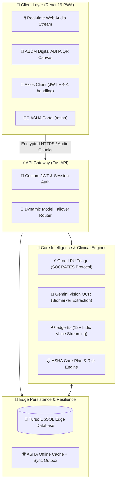
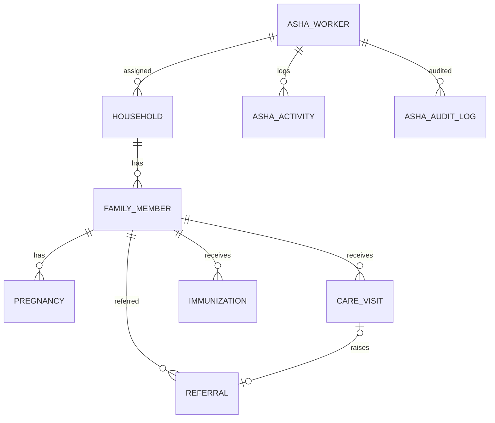
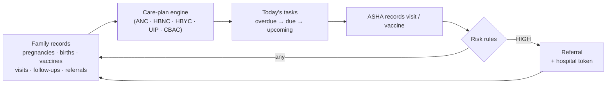

<div align="center">

# 🩺 SehatMitra-AI
### *Next-Gen Voice-First Rural Healthcare Assistant & ABDM Triage Engine*

[](https://react.dev/)
[](https://fastapi.tiangolo.com/)
[](https://groq.com/)
[](https://ai.google.dev/)
[](https://turso.tech/)
[](LICENSE)

<p align="center">
  <b>Bridging the last-mile healthcare divide across rural Primary Health Centres (PHCs) through sub-second dialect voice triage, multimodal lab biomarker OCR, and ABDM-compliant identity records.</b>
</p>

[Explore Live Demo](https://sehat-mitra-ai-kappa.vercel.app/) • [Interactive API Docs](https://sehatmitra-ai.onrender.com/docs) • [Report a Bug](https://github.com/Abhi013-oss/SehatMitra-AI/issues)

</div>

---

## 📌 Table of Contents
- [Executive Overview](#-executive-overview)
- [The Rural Bottleneck vs. SehatMitra Solution](#-the-rural-bottleneck-vs-sehatmitra-solution)
- [Core Architecture](#-core-architecture)
- [Key Engineering Features](#-key-engineering-features)
- [ASHA Portal](#-asha-portal)
- [Tech Stack & Toolchain](#-tech-stack--toolchain)
- [IBM Bob Technology Integration](#-ibm-bob-technology-integration)
- [Quickstart & Local Setup](#-quickstart--local-setup)
- [Environment Variables](#-environment-variables)
- [Future Roadmap](#-future-roadmap)
- [License & Acknowledgments](#-license--acknowledgments)

---

## 🏥 Executive Overview

Rural healthcare systems in low-resource environments face severe operational strains: acute primary doctor shortages, illiterate patient bases struggling with text interfaces, unreadable paper lab reports, and intermittent 2G/3G network drops.

**SehatMitra-AI** is an ultra-resilient, voice-driven clinical triage platform engineered for India's 700M+ rural population. Powered by **Groq LPUs**, **Google Gemini Vision**, **edge-tts**, and a **Turso (libSQL) cloud database**, it enables hands-free consultations in 12+ Indic languages, converts photographed lab reports into regional clinical advice, and generates ABDM-compliant digital ABHA QR cards for zero record loss.

---

## ⚡ The Rural Bottleneck vs. SehatMitra Solution

| Rural Challenge | The Critical Problem | SehatMitra-AI Engineering Solution |
| :--- | :--- | :--- |
| **Literacy & Dialect Gap** | Standard health apps rely on English/Hindi text; browser-native TTS sounds robotic on regional tongues. | **Backend Indic Audio Streaming (`edge-tts`)** with native models (`pa-IN`, `or-IN`, `hi-IN`) for 100% hands-free voice triage. |
| **PHC Doctor Shortages** | 1 doctor per thousands of villagers leads to delayed emergency detection. | **Sub-Second SOCRATES Protocol Triage (Groq LPU)** delivering Tri-Color Risk Badges and doctor preparation checklists. |
| **Lab Report Jargon** | Patients cannot comprehend blood tests (CBC, HbA1c, Lipids), leading to dangerous inaction. | **Multimodal Vision OCR (Gemini Vision)** extracting biomarkers with auto-flagged out-of-range indicators. |
| **Lost Paper Records** | Prescriptions and histories get destroyed between visits; zero longitudinal data. | **ABDM-Compliant Digital ABHA QR Cards** synced over **Turso LibSQL Edge Databases**. |
| **2G/3G Network Drops** | Connection drops trigger 401 token errors, logging users out mid-consultation. | **PWA app-shell caching + offline banner** in the citizen app; the **ASHA portal** keeps last-seen data readable offline and queues visits/vaccines in an outbox that syncs automatically (idempotent `client_ref`, no duplicates). |

---

## 🏗️ Core Architecture



---

## 🚀 Key Engineering Features

### 1. Hands-Free Indic Voice Triage (`edge-tts`)
- Bypasses low-quality browser synthesis via backend asynchronous audio chunk streaming.
- Supports low-resource regional dialects including Punjabi (`pa-IN-OjasviNeural`), Odia (`or-IN-SubhasiniNeural`), and Hindi (`hi-IN-MadhurNeural`).

### 2. Clinical Protocol Enforcement (SOCRATES via Groq)
- Implements the strict clinical **SOCRATES** method (*Site, Onset, Character, Radiation, Associations, Time, Exacerbating factors, Severity*).
- Forces JSON-mode output validated against a fixed schema, delivering risk levels (*Low / Medium / High / Emergency*).
- Reduces (does not eliminate) hallucination risk through **structured JSON output, a rule-based safety net** (keyword triage that still catches emergencies if the LLMs are down) **and human review** — every result is decision support for a clinician, with a disclaimer.

### 3. Multimodal Biomarker Extraction (Gemini Vision OCR)
- Normalises uploads with Pillow before analysis: fixes phone-camera orientation (EXIF), converts to RGB, opens HEIC photos and converts DICOM scans; PDFs are sent to Gemini directly.
- Scans CBC, Lipid, Liver Function, and Blood Sugar records, flagging out-of-range values, enriching them with curated clinical reference notes, and translating them into simple regional advice.

### 4. ABDM Digital Health Identity (Turso Cloud Database)
- Issues an Ayushman Bharat Digital Mission (ABDM) compliant digital ABHA Card with an embedded dynamic QR code.
- Stores patient profiles, ABHA details and consultation/report history in Turso (libSQL) via SQLAlchemy, so records persist across visits and devices.

---

## 👩‍⚕️ ASHA Portal

A mobile-first workspace for **ASHA (Accredited Social Health Activist)** workers, built around NHM / MoHFW guidelines. The **family (household)** is the central record: every pregnancy, home visit, vaccine and referral belongs to a family member.

**Open:** `/asha-login` (or *Login as ASHA Health Worker* in the sign-in popup) · **Demo:** `ASHA-101` / M-PIN `1234`

| Screen | What the ASHA does there |
| :--- | :--- |
| **Today** | Prioritised work list — overdue, due now, coming up — plus an area snapshot |
| **Families** | Search/filter households; register a family (with consent) and its members |
| **Family / Member record** | Members, risk flags, pregnancy timeline (ANC 1–4, Td), child vaccination card, visits, referrals, scheme suggestions |
| **Record visit** | Guided form per visit type (ANC, HBNC, HBYC, NCD/CBAC, general, follow-up) with vitals, danger signs, counselling, live risk warning, referral and follow-up. Optional **voice note** pre-fills the form |
| **Referrals** | Confirm whether the person actually reached the facility |
| **My work** | Monthly report, indicative incentives, community activities (VHSND, meetings) |

**Highlights**
- **Auto-generated tasks** — derived on every request from LMP/EDD, date of birth, the UIP vaccine schedule, past visits, follow-ups and open referrals. Recording the visit or vaccine clears the task.
- **Explainable risk rules** — danger signs + vitals (BP, Hb, SpO₂, sugar, temperature, birth weight, MUAC, CBAC score) give LOW / MODERATE / HIGH with reasons.
- **Emergency referrals** get a token the hospital **Doctor Cockpit** can open.
- **Low connectivity** — last-seen data opens offline; visits and vaccines saved offline sync automatically (no duplicates).
- **Privacy** — DB-backed M-PIN login with lockout, each ASHA sees only her households, consent required at registration, reads/writes audit-logged, local data cleared on logout.
- **Same look as the citizen app** — shared light/dark theme and language switcher; full Hindi translation.

### Data model



### How the work list is built



**Code:** `frontend/src/features/asha/` · `backend/app/models/{family,asha}.py` · `backend/app/services/asha/` · `backend/app/api/v1/endpoints/asha.py`

---

## 🛠️ Tech Stack & Toolchain
Frontend:       React 19, Tailwind CSS, Lucide Icons, Axios, Web Audio API
Backend:        FastAPI, Python 3.11, Pydantic v2, SQLAlchemy ORM
AI / ML:        Groq LPU (gpt-oss-120b/20b, Qwen, Llama 3.3 70B — pre-trained, not fine-tuned), Google Gemini Vision
Speech:         edge-tts (Microsoft Neural Voice Pipeline)
Database:       Turso (libSQL cloud), SQLite / PostgreSQL
Authentication: Firebase Authentication, PyJWT
Deployment:     Vercel (Frontend Client), Render (API Gateway)

---

## 🏢 IBM Bob Technology Integration Insights

This project references the **IBM Bob** concept (a modular, scalable medical knowledge base) to ensure clinical consistency without embedding static doctor notes into every LLM prompt.

| Bob Component | Implemented Pattern in SehatMitra-AI | Technical Pattern |
| :--- | :--- | :--- |
| **Standardized Medical Ontology** | **WHO ICD-11 + AYUSH NAMASTE** dual coding in a curated ontology engine (`ayush_ontology.py`); LLM output constrained to JSON schemas. No model is fine-tuned. | *Curated Ontology + Constrained Generation* |
| **Clinical Protocols** | **SOCRATES** structured reasoning applied strictly over symptoms input. | *Protocol-Driven Logic* |
| **Clinical Knowledge Base** | Curated, auditable rules are the source of truth for safety decisions (herb–drug interaction graph, ASHA risk thresholds, NHM care schedules); pre-trained LLMs (via Groq/Gemini) handle language — conversation, summaries and parsing. | *Embedded Knowledge* |
| **Natural Language Processing Layer** | **edge-tts** frontend integration for Indic languages; real-time symptom translation. | *Voice UI* |
| **Data Storage & Integration** | **Turso (libSQL) cloud database** for user histories and ABDM records; ASHA offline outbox with idempotent sync. | *Persistence & Sync* |

---

## ⚡ Quickstart & Local Setup

### Prerequisites
- Node.js 16+ & npm
- Python 3.11+
- Google Gemini API Key
- Groq API Key

### Frontend Setup
```bash
cd frontend
npm install
npm run dev
```

### Backend Setup
```bash
python -m venv .venv
# On Windows:
.venv\Scripts\activate
# On Linux/macOS:
source .venv/bin/activate
cd backend
pip install -r requirements.txt
uvicorn app.main:app --reload
```

> **Note:** Locally the backend uses a SQLite file (`DATABASE_URL`); for production configure Turso. On first start it creates the tables and seeds the ASHA demo village. To re-seed with fresh dates: `python -m scripts.seed_asha_demo --reset` (from `backend/`).

---

## 🔮 Future Roadmap
1. **ABHA OTP Service Integration**: Full implementation of India Stack verification for seamless patient onboarding.
2. **Smart Prescription Engine**: Auto-generation of e-prescriptions compliant with Indian medical board standards.
3. **Health Insurance Integration**: API-level integration with Indian health insurance providers for instant claim processing.
4. **Government Dashboard**: A centralized dashboard for Primary Health Centre (PHC) officers to monitor community health trends.
5. **Offline-First Caching**: Enhanced PWA caching strategies for unreliable 2G/3G rural networks.
6. **ANM / Supervisor View**: Sub-centre dashboard over the ASHA households, with role-based access.
7. **Family Self-Access**: Let citizens linked to a household see their own family record.